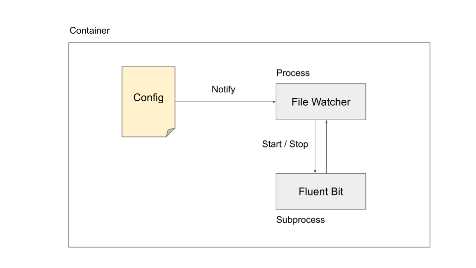

# Fluent Bit

This project is a fork of [fluentd/fluent-bit](https://github.com/fluent/fluent-bit). Due to the known [issue](https://github.com/fluent/fluent-bit/issues/365), the original Fluent Bit doesn't support dynamic configuration. To address that, we incorporate a [configuration reloader](main.go) on top of the original. 

## Development

The following files have been either modified or added in comparison with the original Fluent Bit:

- [main.go](main.go): implementes configuration reloader in Golang.
- [Dockerfile](Dockerfile): launches main.go instead of fluent bit core.
- [fluent-bit.conf](conf/fluent-bit.conf): links to `/fluent-bit/config/fluent-bit.conf`, the location for dynamic configuration

